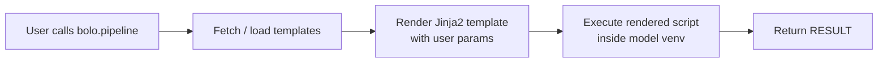

<p align="center">
    <a href="https://github.com/illinoisdata/bolo/blob/main/LICENSE"></a>
    <a href="https://github.com/illinoisdata/bolo-templates/releases/tag/v0.1.0"></a>
    <a href="https://pypi.org/project/bolo"></a>
</p>

<p align="center">
  
</p>

<h1 align="center">Bolo: Curated, Verified, and Ready-to-run Inference Pipelines for HuggingFace Models</h1>

**Bolo** is a lightweight Python library that gives you curated, verified, and ready-to-run inference pipelines for HuggingFace models with ZERO efforts.

📦 **Curated templates**: every supported model ships with a tested Jinja2 inference template maintained by the Illinois CreateLab team.

🔒 **Isolated venvs**: each model runs inside its own `uv`-managed virtual environment, so dependency conflicts between models are impossible.

⚡ **One-call API**: `bolo.pipeline(repo_id, device="cuda", ...)` conducts inference in one API call, simpler than HuggingFace two-stages `pipeline` API.

🖥️ **CLI included**: a `bolo` command lets you manage venvs and run inference directly from the shell.

🌐 **Auto-fetching templates**: template bundles are downloaded on first use from the [bolo-templates](https://github.com/illinoisdata/bolo-templates) GitHub release and cached locally — no manual setup needed.

## Quick demo

Install bolo:

```bash
pip install bolo
```

Run inference with two lines of Python:

```python
import bolo

result = bolo.pipeline("<REPO_ID>", device="cuda:0")
print(result)
```

Before running inference you can inspect what parameters the template accepts:

```python
bolo.list_params("<REPO_ID>")
```

And manage venvs explicitly:

```python
python_bin = bolo.create_a_venv("<REPO_ID>")
# ... activate the created venv and do inference ...
bolo.remove_venv("<REPO_ID>")
```

## CLI

The `bolo` command mirrors the Python API from your shell.

**Create an isolated venv for a model:**
```bash
bolo create-venv <REPO_ID>
bolo create-venv <REPO_ID> --venv-path /path/to/venv
# then activate the venv
```

**Run inference:**
```bash
bolo run <REPO_ID> device=cuda:0
```

**Pre-download the templates cache (optional, useful on air-gapped machines):**
```bash
bolo fetch-templates
```

## How does bolo work?

bolo separates *what to run* (the Jinja2 template) from *where to run it* (the model's isolated venv).



1. **Templates** — stored in the [bolo-templates](https://github.com/illinoisdata/bolo-templates) release bundle. Each model folder contains a `template.j2` (the inference script template) and a `requirements.txt` (the model's exact dependencies). Templates are downloaded once and cached at `~/.cache/bolo/templates/`.

2. **Venvs** — created with `uv venv` + `uv pip install -r requirements.txt`. Every model gets its own venv so you can safely use models with conflicting PyTorch or CUDA versions side-by-side.

3. **Rendering** — template parameters are collected from the leading `` blocks in each `template.j2`. `bolo list_params` shows you every knob with its type and default value.

4. **Execution** — the rendered script is executed and its `RESULT` variable is returned to the caller.

## Install from source

```bash
git clone https://github.com/illinoisdata/Bolo.git
cd Bolo
pip install -e .
```

## Custom templates directory

Set `BOLO_TEMPLATES_DIR` to point bolo at your own templates folder:

```bash
export BOLO_TEMPLATES_DIR=/path/to/my/templates
```

## Contributing

Contributions are welcome! Please open an issue or pull request on [GitHub](https://github.com/illinoisdata/bolo/issues).

## License

MIT — see [LICENSE](LICENSE) for details.

## Acknowledgement
- Thanks Jojo and her sister for designing the mascot.